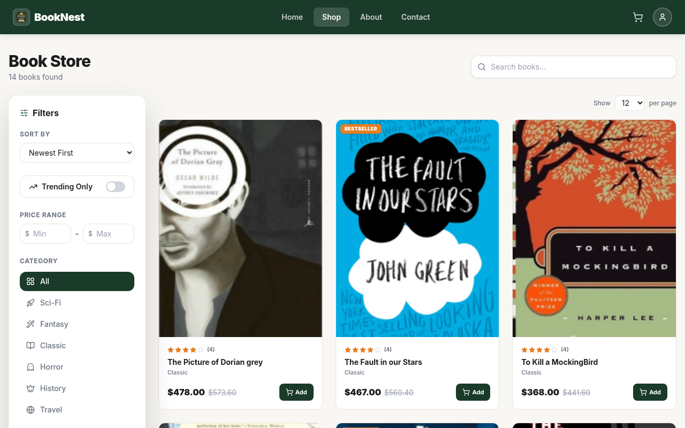
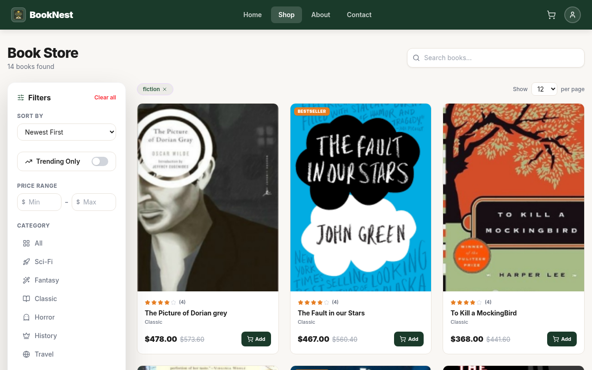
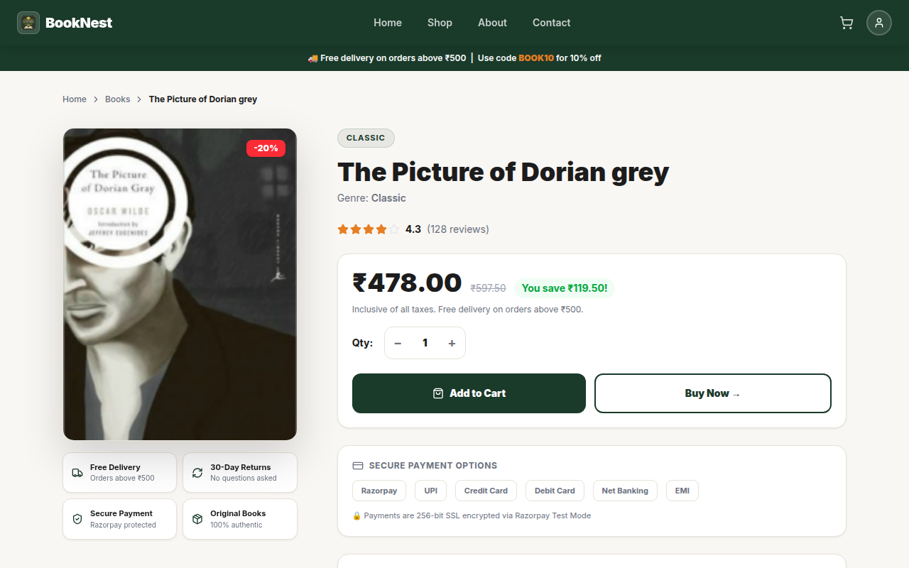
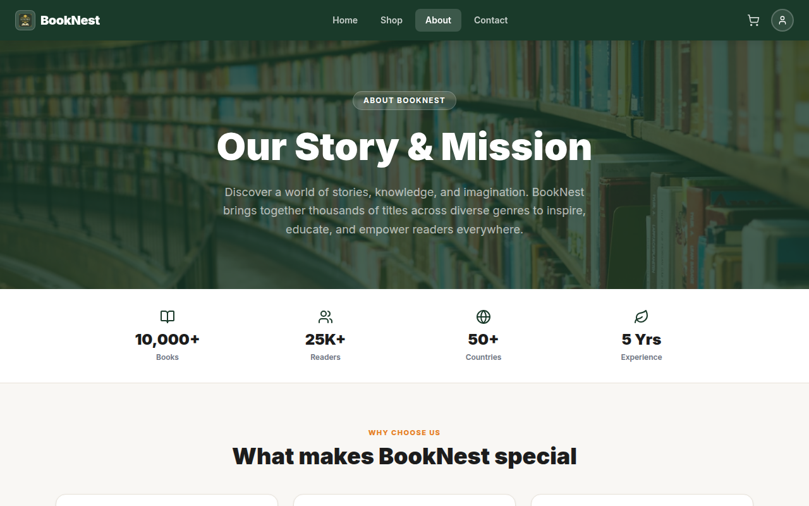
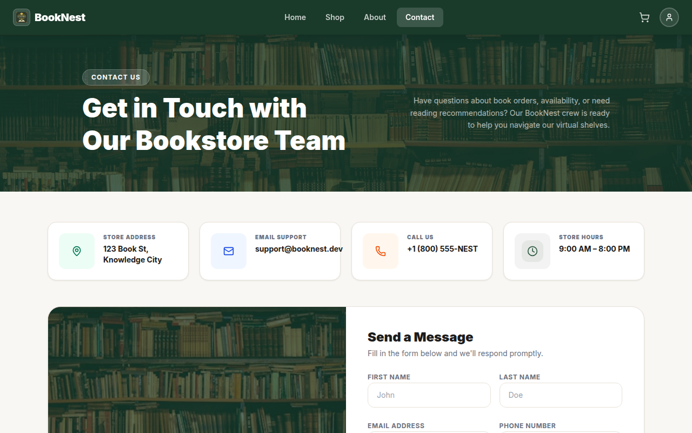
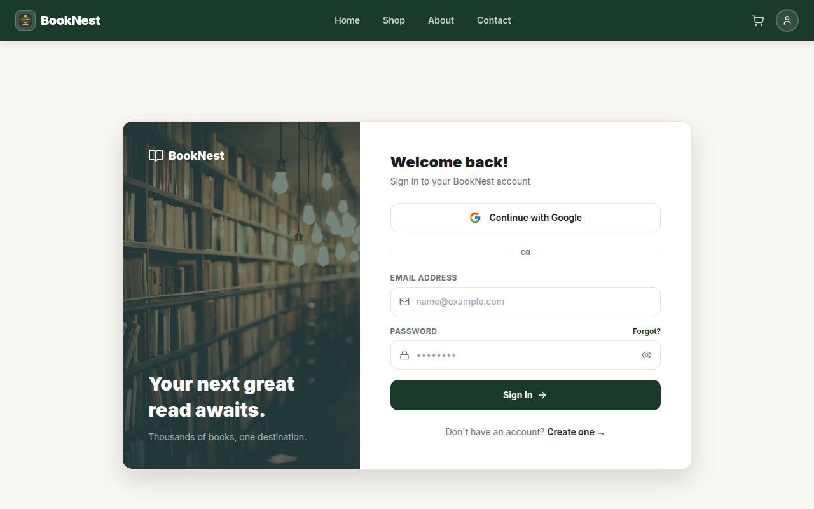
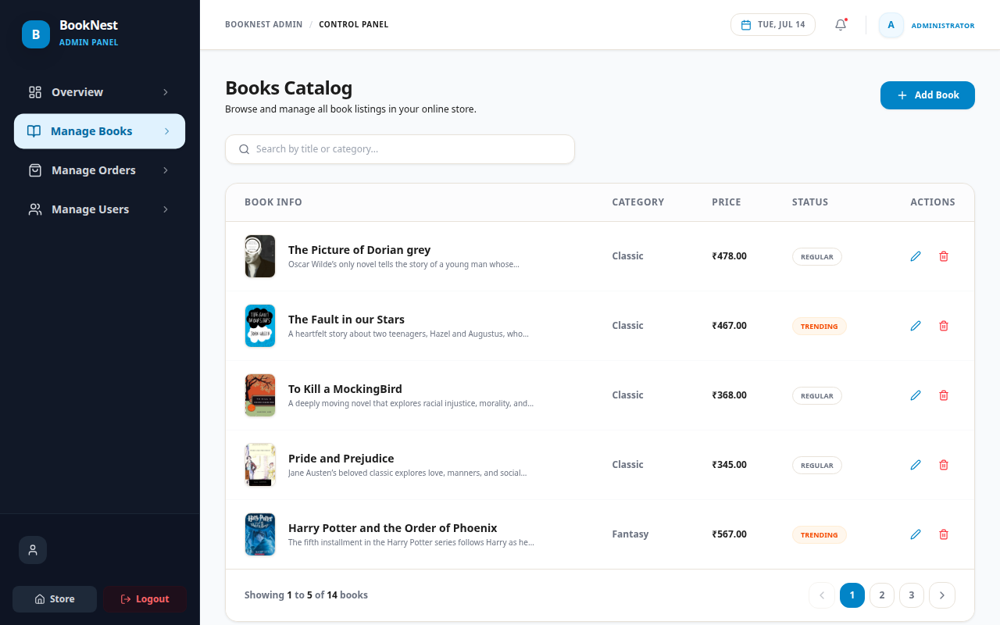
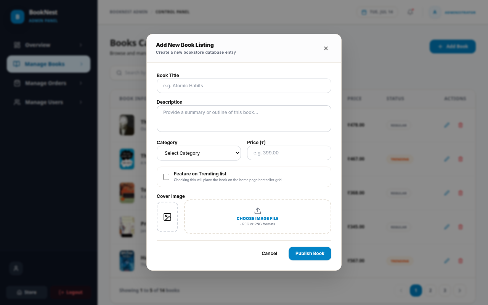
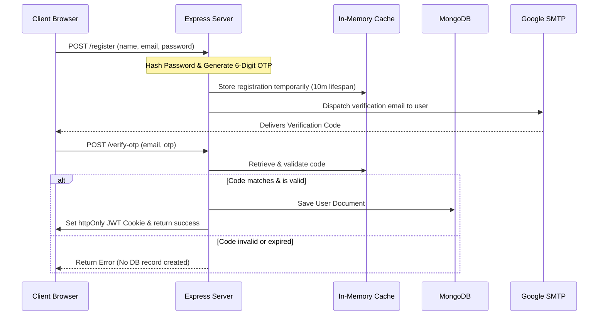

# 📚 BookNest - Premium Bookstore Web Application

BookNest is a state-of-the-art, secure, and highly aesthetic MERN stack bookstore application. Built with **React (Vite)**, **Node.js/Express**, **MongoDB**, and **Redux Toolkit**, the application features a warm premium bookstore theme, interactive search and filtering, Razorpay test mode payment integration, a secure two-step registration flow with in-memory OTP verification, and an advanced admin dashboard.

---

## 📸 Application Gallery

Here is a visual tour of the BookNest store and admin application:

### 🏠 User Storefront & Catalog

#### Homepage
A welcoming storefront with a category-aware search hero, clean stats bar, and trending books display.


#### Products Catalog
Full bookstore catalog with multi-factor sidebar filtering, price range controls, and sorting options.


#### Categorized Products View
Direct filter navigation showing books belonging specifically to the selected category (e.g. Fiction).


#### Product Details Page
Immersive view showing cover arts, synopsis details, pricing, and the main "Add to Cart" checkout entry point.


#### Shopping Cart
A beautiful sidebar checkout flow allowing quantity edits, price calculations, and Razorpay-secured checkout.


---

### 🛡️ Authentication & Info Screens

#### About Page
Our mission, numbers, and reader testimonials styled in a clean grid-based editorial format.


#### Contact Page
A beautiful card-based office directory and message dispatch form.


#### Login Page
A split-screen minimalist authentication prompt.


---

### 👑 Admin Control Panel

#### Admin Books Dashboard
A dashboard containing database stats, paginated product tables, and search controls.


#### Beautiful Portal Modal (Add Book)
Add/edit book entries using React Portals to ensure backdrop blurring and modal priority.


---

## 🎨 Visual Identity & Design System

The application is styled with a custom-engineered **warm light bookstore aesthetic** designed to look modern and elegant.
- **Base Background**: Warm, off-white bookish background (`#f9f7f4`) and clean white container cards.
- **Accents**: Deep forest green (`#1a3a2a`) for major heroes, sky blue (`#0284c7`) for admin controls, and warm sunset orange (`#e67e22`) for prices, star ratings, and action highlights.
- **Micro-Animations**: Smooth page transition fade-ins, hover scaling on cards, and React Portal-rendered modals with viewport-wide backdrop blurs.

---

## 🏗️ Architecture & Flow Overview

### 🔐 In-Memory OTP-Based Account Registration
To prevent database bloat from unverified email accounts:
1. **Details Submitted**: When a user registers, credentials (including pre-hashed passwords) are captured.
2. **Temporary Registry**: The user info is stored inside an **in-memory server-side cache (`pendingRegistrations`)** along with a cryptographically secure 6-digit OTP code and a 10-minute expiry timestamp.
3. **Dispatch**: NodeMailer delivers the premium HTML OTP email to the user's Gmail using secure SMTP.
4. **Validation & Creation**: If the user submits the correct OTP before expiry, the system writes the record into MongoDB and signs a JWT. Otherwise, the session automatically expires and is deleted from memory without writing trash data to MongoDB.



---

## 📂 Project Structure

```text
BookNest/
├── backend/
│   ├── src/
│   │   ├── config/         # Database and Cloudinary integration configurations
│   │   ├── controllers/    # Route controllers (Auth, Books, Orders, Users)
│   │   ├── middlewares/    # Authentication and admin checks
│   │   ├── models/         # Mongoose Schemas (User, Book, Order)
│   │   ├── routes/         # Express API routers
│   │   └── utils/          # Helper utilities (OTP generators, SMTP transporter)
│   ├── index.js            # Entrypoint
│   └── .env.example
├── frontend/
│   ├── src/
│   │   ├── api/            # Axios setup and endpoints lookup
│   │   ├── components/     # UI Components (Navbar, Footer, Hero, Cards)
│   │   ├── data/           # Categories definition and icons mappings
│   │   ├── redux/          # Redux Slices (Auth state, Cart state)
│   │   ├── pages/          # Application screens (Home, Products, Details, Profile)
│   │   ├── routers/        # Route setups & Role Protection guards
│   │   ├── index.css       # Standard styling variables
│   │   └── App.css         # Global tailwind classes & transition setups
│   └── package.json
├── screenshots/            # Pre-captured high-fidelity PNG screenshots
└── README.md
```

---

## 🛠️ API Reference Table

### Authentication (`/api/auth`)
| Method | Endpoint | Description | Access |
|---|---|---|---|
| `POST` | `/register` | Initiates signup, hashes password, saves to memory cache, and emails OTP. | Public |
| `POST` | `/verify-otp` | Validates signup OTP and writes the user to the database. | Public |
| `POST` | `/resend-otp` | Generates and sends a new registration OTP code. | Public |
| `POST` | `/login` | Signs in verified users (or redirects unverified users to OTP prompt). | Public |
| `POST` | `/forgot-password` | Sends password reset OTP to registered email. | Public |
| `POST` | `/reset-password` | Verifies reset code and saves new password. | Public |
| `PUT` | `/update-profile` | Updates account info, shipping address, or profile picture. | Authenticated |
| `GET` | `/me` | Fetches session user profile details. | Authenticated |
| `POST` | `/logout` | Destroys session cookies and clears state. | Authenticated |

### Books Catalog (`/api/books`)
| Method | Endpoint | Description | Access |
|---|---|---|---|
| `GET` | `/api/books` | Fetches books with paginated results, search term, categories, price range, and trending filter. | Public |
| `GET` | `/api/books/:id` | Fetches details for a single book. | Public |
| `POST` | `/api/books/create` | Adds a new book and uploads image cover to Cloudinary. | Admin Only |
| `PUT` | `/api/books/edit/:id` | Updates book details or changes cover picture. | Admin Only |
| `DELETE` | `/api/books/delete/:id` | Deletes a book and deletes file resource from Cloudinary storage. | Admin Only |

---

## ⚙️ Environment Variables Config

### Backend Configuration (`backend/.env`)
Create a `.env` file under the `/backend` directory:
```env
# Server
PORT=5000
MONGO_URL=mongodb+srv://<username>:<password>@cluster.mongodb.net/BookNest
JWT_SECRET=your_super_secret_jwt_signature_key

# Admin Seed Accounts
ADMIN_EMAIL=admin@booknest.dev
ADMIN_PASSWORD=Admin@12345

# Cloudinary Integration
CLOUDINARY_CLOUD_NAME=your_cloudinary_cloud_name
CLOUDINARY_API_KEY=your_cloudinary_api_key
CLOUDINARY_API_SECRET=your_cloudinary_api_secret

# Google OAuth Configuration
GOOGLE_CLIENT_ID=your_google_client_id.apps.googleusercontent.com
GOOGLE_CLIENT_SECRET=your_google_client_secret
GOOGLE_CALLBACK_URL=http://localhost:5000/google/callback

# SMTP Gmail Configuration
EMAIL_USER=your_sender_account@gmail.com
EMAIL_PASS=your_gmail_app_password

# Razorpay Payment Gateway Configuration
RAZORPAY_KEY_ID=rzp_test_TDMlwoGExxxx
RAZORPAY_KEY_SECRET=5jhWmxxxxxxxxx
```

---

## 🚀 Setup & Launch Instructions

### Prerequisites
- Node.js installed (v16+)
- A MongoDB cluster instance
- A Google Account with 2-Factor Authentication enabled to generate an App Password.

### 1. Install & Configure Backend
```bash
cd backend
npm install
# Configure your variables in .env
npm run dev
```

### 2. Install & Configure Frontend
```bash
cd ../frontend
npm install
npm run dev
```
Open [http://localhost:5173](http://localhost:5173) in your browser to experience **BookNest**.
